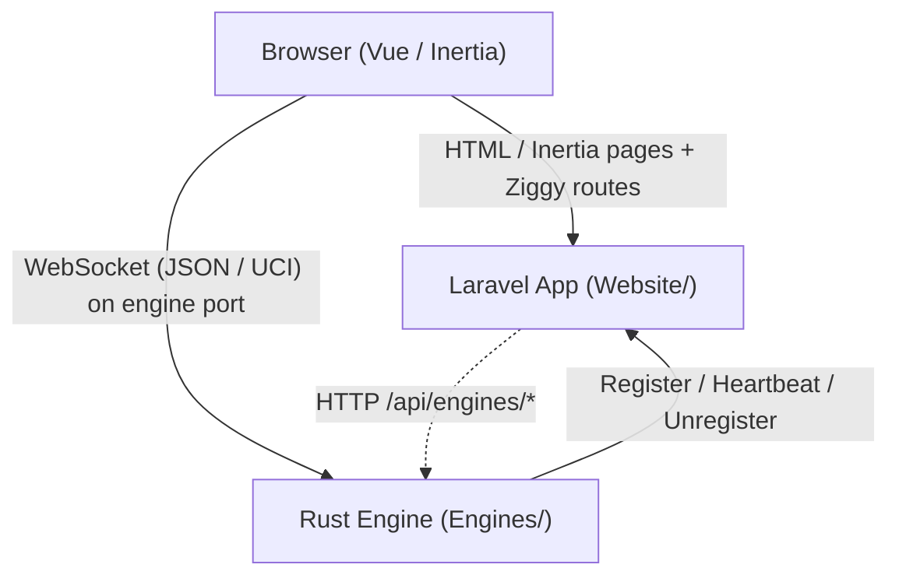

# MiChess — Agent Guide

MiChess is a browser chess application ("Chess Website With Custom Position Or Pieces"). It is a
three-tier system: an Inertia/Vue front end served by a Laravel application, which coordinates one or
more standalone Rust chess engines over WebSocket.

Documentation in this repository is written in English.

## Repository layout

The root repository holds only orchestration, Docker configuration and documentation. The two
application codebases are **git submodules** — they are separate repositories, not directories in
this repo.

```
MiChess/                      (this repo — CC BY 4.0 docs/orchestration only)
├── Website/   -> git submodule  github.com/YueMi-Development/MiChess-Web     (proprietary)
├── Engines/   -> git submodule  github.com/YueMi-Development/MiChess-Engine  (proprietary)
├── docker/    docker/README.md, env-template.txt, php-fpm-www.conf
├── docker-compose.yml         web + engine-normal + db + redis
├── .agents/rules/             PHP/Laravel coding rules (see "Mandatory coding rules")
└── AGENTS.md, CLAUDE.md       CLAUDE.md is a symlink to AGENTS.md
```

Submodules carry their own instructions; read them before editing there:

**Licensing:** the root repository is CC BY 4.0 (attribution required for public use). Both
submodules are proprietary/private and may not be used publicly. Do not copy submodule content into
the root repo.

Commit history shows a submodule-pointer workflow: changes are committed inside each submodule
first, then the pointer is bumped from the root repo (`chore: update Website submodule to latest
commit`).

## Tech stack

| Layer | Technology |
|-------|-----------|
| Web app | Laravel 12, PHP 8.2+ (rules require 8.3), Inertia.js 2, Vue 3, Ziggy 2 |
| Auth scaffolding | Laravel Breeze 2.4 (Vue + Inertia variant) |
| Styling | Tailwind CSS 3 (`darkMode: 'class'`), `@tailwindcss/forms` |
| Front-end build | Vite 7 + `laravel-vite-plugin` 2 |
| Front-end extras | Font Awesome 7, SweetAlert2 11, vue3-apexcharts, lodash, axios |
| Engine | Rust 2021, UCI Protocol, Tokio, tokio-tungstenite, reqwest, serde/serde_yaml, tracing |
| Database | MySQL 8 in Docker; SQLite by default for local/test |
| Cache / queue / session | Redis 7 in Docker; database or array drivers otherwise |
| Testing | Pest 4 (Laravel plugin) for PHP; built-in `#[cfg(test)]` for Rust |
| Runtime | Docker Compose (nginx + php-fpm + supervisor in the web image) |

## Build, test and run commands

### Full stack (Docker)

```bash
docker-compose up -d
docker-compose logs -f
docker-compose down
docker-compose build engine-normal    # required after Rust changes
```

The web image runs `docker/entrypoint.sh`, which waits for the DB, runs `php artisan migrate
--force`, clears caches, links storage, runs `artisan optimize`, then starts supervisord.
Supervisord manages four programs: `php-fpm`, `nginx`, `laravel-queue` (`queue:work --sleep=3
--tries=3 --max-time=3600`) and `laravel-schedule` (`schedule:work`).

The engine image builds the Rust binary in a `rust:latest` stage and, at container start,
generates `/app/config/config.yml` from environment variables (generating a random pairing key
when `PAIRING_KEY` is unset) before exec'ing the binary.

### Website (run from `Website/`)

```bash
composer install                      # or: composer setup (install + .env + key + migrate + npm + build)
cp .env.example .env && php artisan key:generate
php artisan migrate
npm install && npm run dev            # or: npm run build

composer dev                          # concurrent: artisan serve + queue:listen + pail + vite
php artisan test                      # runs Pest (see caveat below)
./vendor/bin/pest                     # equivalent
./vendor/bin/pint                     # code style (laravel/pint is a dev dependency)
npm run build / npm run dev           # vite
```

**Verification caveat (observed, 2026):** in the current working tree `php artisan test` fails with
`Command "test" is not defined`, and `vendor/bin/pest` / `vendor/bin/phpunit` do not exist —
the installed `vendor/` is incomplete (missing `pestphp/*`, `laravel/breeze`, `laravel/sail`, and
most of `tightenco/ziggy`). `vendor/laravel/framework`, `inertiajs/inertia-laravel` and
`vendor/tightenco/ziggy/dist` are present, so the app itself runs. Run `composer install || composer
update` before relying on the PHP test suite.

`phpunit.xml` defines two suites — `tests/Unit` and `tests/Feature` — and forces the test
environment: `DB_CONNECTION=sqlite`, `DB_DATABASE=:memory:`, `CACHE_STORE=array`,
`SESSION_DRIVER=array`, `QUEUE_CONNECTION=sync`, `MAIL_MAILER=array`, `BCRYPT_ROUNDS=4`.
`tests/Pest.php` binds `RefreshDatabase` to everything in `Feature`.

### Engines (run from `Engines/`)

```bash
cargo build                 # dev build
cargo build --release       # production binary
cargo test                  # 2 unit tests in src/shared/websocket.rs — both pass
cargo run                   # starts the WebSocket server + registers with Laravel
cargo clippy / cargo fmt
```

### Engine configuration

Loaded by `src/config/config_loader.rs`, first match wins:

1. `/app/config/config.yml`  2. `/app/config.yml`  3. `./config.yml`  4. `./config/config.yml`

If none exists, defaults are used. Every value can be overridden by environment variable
(`ENGINE_NAME`, `ENGINE_MODE`, `ENGINE_PORT`, `ENGINE_ENDPOINT`, `PAIRING_KEY`,
`FRONTEND_ENDPOINT`, `LARAVEL_ENDPOINT`). `ENGINE_ENDPOINT` is the host the browser uses to reach
the engine socket, so it must not be the engine's `0.0.0.0` bind address. See
`Engines/config.yml.example`. `config.yml` is git-ignored because it contains the pairing key.

## Architecture

### How the pieces talk



1. On start the Rust engine POSTs to `{laravel_endpoint}/api/engines/register` with its name, mode,
   pairing key, endpoint and port, then sends a heartbeat every `heartbeat_interval_secs` (default
   10) and a DELETE on Ctrl-C.
2. Laravel persists engines in the `engines` table (statuses `offline` / `online` / `error`, with
   `last_seen`). The admin UI and the game-mode list read from it.
3. For a game, `GameController::play()` picks the first **online** engine of the requested mode and
   hands its `ws://host:port` URL to the Vue page, which opens the WebSocket directly to the engine.
   All move traffic then bypasses Laravel.

### UCI & WebSocket protocol

Communication between the front end and the engine occurs over WebSocket using standard **UCI (Universal Chess Interface)** principles wrapped with JSON/text framing:

- **UCI Commands supported:** `uci`, `isready`, `position` (startpos / moves), `go`, `stop`, `quit`, `ucinewgame`, `setoption`, `d`/`debug`, `eval`.
- **WebSocket Message Framing:** Incoming messages are parsed as JSON commands (e.g. `{ "type": "uci" }`, `{ "type": "make_move", "move": "e2e4" }`, `{ "type": "uci_command", "command": "go depth 6" }`, `{ "type": "position", ... }`, `{ "type": "reset" }`), with fallback support for raw text UCI commands.
- **Engine Responses:** JSON responses include `welcome`, `position_set`, `move_result`, `game_state`, `game_reset`, `uci_response` (containing UCI info / bestmove output), and `error`.

## Mandatory coding rules (`.agents/rules/`)

These apply to all PHP work in `Website/`. `.claude/rules/` holds identical copies.

- **Baseline** — Laravel 12.x, PHP 8.3, PSR-12, Eloquent (raw SQL only when explicitly requested).
  **Every PHP file must start with `declare(strict_types=1);`.** Newer files in this repo do; some
  Breeze-generated and earlier files do not.
- **Naming** — PascalCase for classes, camelCase for methods/variables, `Iface` suffix
  `Interface` for interfaces, UPPER_SNAKE_CASE constants (only when an enum does not fit),
  snake_case plural tables and snake_case columns, kebab-case RESTful routes.
- **Structure** — `app/Contracts/Repositories`, `app/Repositories/Eloquent`, `app/Services`,
  `app/DTOs`, `app/Enums`, `app/Models`, `app/Http/Controllers`. Contracts define behaviour;
  repositories do data access only; services hold business logic; controllers orchestrate.
  Most of this structure is prescribed but not yet built out in the repo today.
- **PHP style** — typed parameters and return types; constructor property promotion; `readonly`
  where possible; services should be `final`; prefer enums over constants and `match` over long
  if/else chains. Forbidden: untyped methods, dynamic properties, unjustified static state.
- **Repositories** — every repository needs an interface and must be depended on via that
  interface; data access only; no validation, no `Request`/`Auth`/`Session`/HTTP references;
  generic method names (`findByStatus(UserStatus $status)`, not `getUsersForDashboard()`).
- **Services** — `final`; accept DTOs, never `Request` objects; no HTTP concerns; may throw domain
  exceptions. **Database transactions are allowed only in services.**
- **Controllers** — thin; validation via Form Requests; no queries, no business logic; explicit
  return types.
- **DTOs / Enums** — DTOs are `final` + `readonly`, mapping only, no DB access, reusable; enums are
  preferred over constants for statuses, types and modes.
- **Dependency injection** — inject interfaces, never resolve dependencies manually, bind
  interfaces in service providers, no facades inside services or repositories.
- **Reusability** — no feature-specific repository methods, no request-aware repositories, no
  hard-coded assumptions; before adding logic ask "can this be reused in another feature?".

## Security notes

- `Website/.env` and `Website/.env.docker` are both git-ignored, but `docker-compose.yml` and
  `.env.docker` contain a committed `APP_KEY` and hard-coded MySQL credentials
  (`michess`/`michess`, root `root`). Treat these as development-only values; rotate them for any
  real deployment and do not reuse them.
- `Engines/config.yml` is git-ignored because it holds the pairing key. The Docker image generates a
  fresh random key at container start when `PAIRING_KEY` is unset. The pairing key is the only
  credential identifying an engine, and `GET /api/engines/{engine}` returns it in the response body.
- The engine API routes are unauthenticated and include mutation endpoints (`register`,
  `unregister`, `generate-key`, and `destroy`); restrict them at the network layer in production.
- `bootstrap/app.php` sets `trustProxies(at: '*')`, which trusts arbitrary forwarding headers — only
  safe behind a trusted reverse proxy.
- The engine WebSocket server binds `0.0.0.0` and performs no authentication on the socket; any
  client that knows host and port can drive the board.
- Never commit `.env`, `config.yml`, or any generated pairing key.

## Conventions and workflow notes

- API responses follow `{ success: bool, message?: string, data: ... }`.
- Admin UI tables and the engine list call the JSON API with `fetch()` rather than Inertia visits;
  page-level CRUD (users, monitoring) uses Inertia forms and `router.reload({ only: [...] })`.
- Delete and restart actions confirm through SweetAlert2 (`Composables/useSwal.js`) — use it rather
  than `window.confirm` for consistency.
- Expose sensitive display data through the `Censor` helper / `censorship.js` rather than printing
  it raw.
- Tailwind convention from `tailwind.config.js`: the `black` colour is overridden to `#131a20`,
  `primary` is `blue`, and the sans stack is Figtree.
- Commit messages follow a Conventional-Commits-like style: `feat(engine): ...`,
  `chore(docker): ...`, `chore: update Website submodule to latest commit`.
